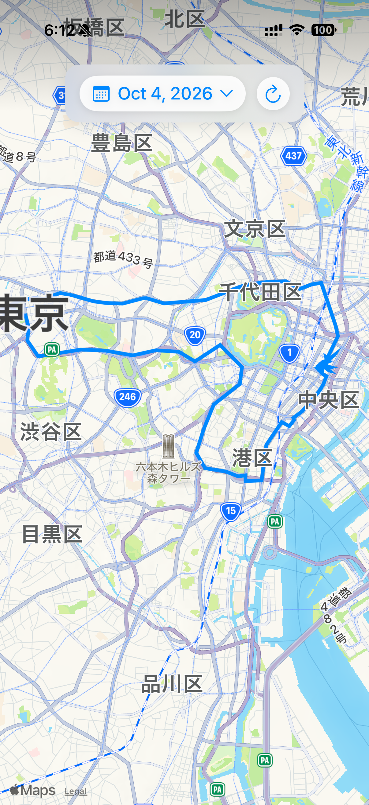

# MotoPath

MotoPath は、移動した道のりを日付ごとに地図で振り返るための iPhone アプリです。記録と閲覧に必要な機能に絞った、シンプルで軽量な構成です。

## アプリ画面

## できること

- 位置情報から移動ルートを自動で記録
- 記録のある日をカレンダーから選択し、その日のルートを地図に表示
- 地図上のルートを更新ボタンで再読み込み

## 軽量な設計

画面は地図と日付選択を中心に構成しています。位置情報の保存には 30 秒の最短間隔を設け、位置更新には 25 m の距離フィルターを設定しています。記録は端末内の Core Data に保存します。

これらは記録や画面をシンプルに保つための設計です。位置情報の取得は継続するため、バックグラウンド記録中の電池消費が小さいことを保証するものではありません。

## 使い方

1. アプリを起動し、表示される位置情報の利用許可を選びます。
2. 移動すると位置情報が記録されます。
3. 画面上部の日付をタップして記録のある日を選び、地図でルートを確認します。最新の記録を表示したいときは更新ボタンをタップします。

## 位置情報の利用許可

MotoPath はルートの記録に位置情報を使用します。初回起動時にまず「アプリの使用中」を求め、バックグラウンドでも記録するために続けて「常に」の許可を求めます。

| 許可の状態 | 記録できる範囲 |
| --- | --- |
| 常に | アプリの使用中とバックグラウンドで位置情報を記録します。 |
| アプリの使用中 | アプリの使用中に記録します。バックグラウンドでの継続記録には「常に」が必要です。 |
| 許可しない | 新しい位置情報を記録できません。 |

許可は iPhone の「設定」→「プライバシーとセキュリティ」→「位置情報サービス」→「MotoPath」から変更できます。ルートを正確に記録したい場合は「正確な位置情報」をオンにしてください。権限や端末の設定、電波状況などにより、記録が途切れる場合があります。

記録した位置情報は端末内に保存されます。位置情報の利用許可は、利用者が選択できます。
